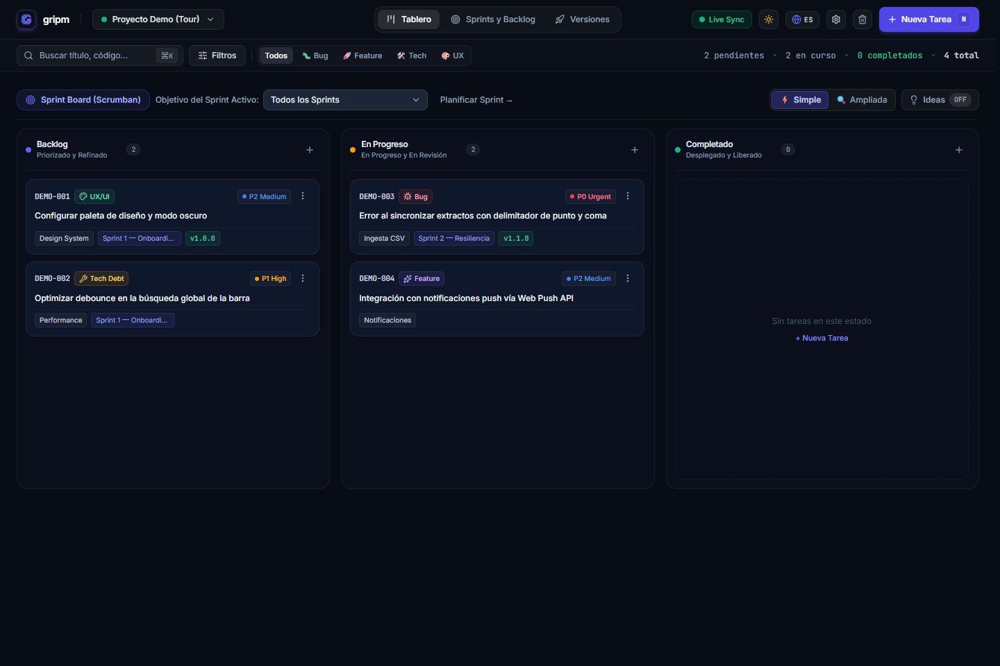
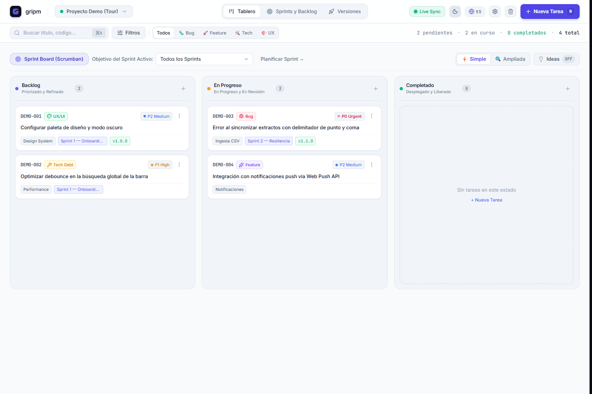
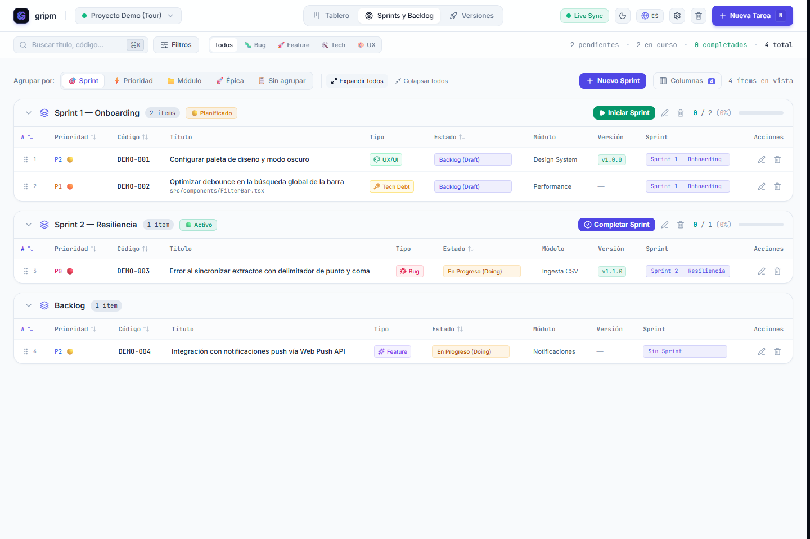
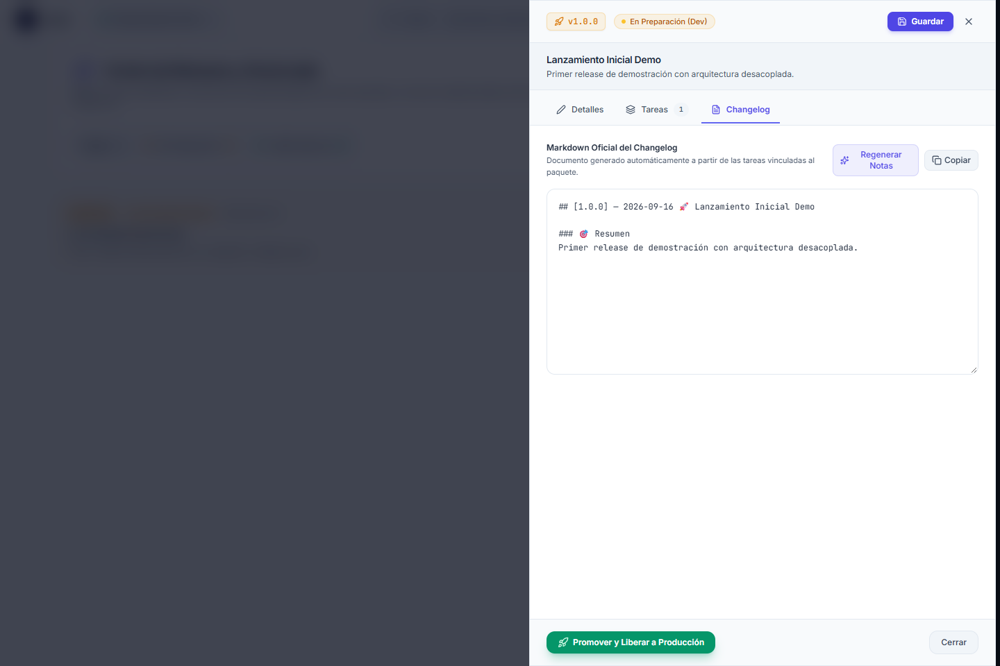

<p align="center">
  
</p>

<h1 align="center">gripm ⚡</h1>

<p align="center">
  <strong>Un espacio local-first para gestionar el trabajo de producto e ingeniería, planificar iteraciones y colaborar con agentes de IA.</strong>
</p>

<p align="center">
  🌐 <strong><a href="README.md">English</a></strong> | <strong><a href="README.es.md">Español</a></strong>
</p>

<p align="center">
  <a href="https://github.com/pablojavierrodriguez/gripm-playbook"></a>
  <a href="LICENSE"></a>
  <a href="https://modelcontextprotocol.io/"></a>
  <a href="https://nodejs.org">=22.6.0" /></a>
  <a href="#capturas-de-pantalla"></a>
</p>

<p align="center">
  <a href="#capturas-de-pantalla"></a>
</p>

> **Tu hoja de ruta no debería vivir en servidores ajenos.** Gripm mantiene el trabajo de producto e ingeniería junto a tu código: local-first, versionable con Git y preparado para agentes de IA.

**gripm** (*"grip-em"*) es un espacio local para gestionar listas de trabajo de producto e ingeniería, planificar iteraciones y preparar versiones. Da a los agentes de IA (Cursor, Claude Code, Copilot, Antigravity) especificaciones estructuradas y criterios de aceptación verificables sin trasladar tu hoja de ruta a servicios de terceros.

Construido con **React 18**, **Vite**, **TypeScript** y **Tailwind CSS**.

> **Historial del proyecto:** v1.0.0 fue la última versión bajo el nombre DevBoard. Desde v1.0.1, las versiones se publican con el nombre canónico Gripm. Los datos de proyectos existentes se detectan y migran de forma transparente.

---

## ⚡ Inicio Rápido (Menos de 1 minuto)

No necesitas configurar servidores ni bases de datos en la nube. Todo vive en tu máquina y junto a tu código.

### 1. Instala Gripm Board
Requiere Node.js 22.6.0 o posterior:
```bash
npm install -g @gripm/board
```
*(O ejecútalo bajo demanda sin instalación global con `npx @gripm/board`)*

### 2. Inicializa tu proyecto
Abre una terminal en la raíz de tu proyecto (ej: `mi-app`) y ejecuta:
```bash
gripm --init
```
> **¿Qué hace esto?** Crea la carpeta `backlog/` donde se guardan tus tareas en archivos Markdown y genera el archivo `AGENTS.md` con las reglas de trabajo para que tus agentes de IA sepan cómo colaborar en tu repositorio.
> 
> *Para pipelines de CI o modo no interactivo sin preguntas:* `gripm --init -y`

### 3. Abre tu tablero
```bash
gripm
```
El CLI abrirá automáticamente el tablero visual en tu navegador predeterminado (`http://localhost:4100`).

---

## 🤖 Conecta tu Agente de IA (Cursor, Claude, Antigravity)

Gripm incluye un servidor **MCP (Model Context Protocol)** que le da a tus agentes ojos y manos sobre tu backlog en tiempo real, sin necesidad de abrir el navegador.

### Paso 1: Configura el servidor MCP en tu cliente de IA
Agrega esta configuración a los ajustes MCP de tu editor (ej. `claude_desktop_config.json` o en la sección MCP de Cursor):

```json
{
  "mcpServers": {
    "gripm": {
      "command": "gripm-mcp",
      "args": ["--repo", "/ruta/absoluta/a/mi-proyecto"]
    }
  }
}
```
*Si no instalaste Gripm globalmente, puedes iniciarlo con `npx`:*
```json
{
  "mcpServers": {
    "gripm": {
      "command": "npx",
      "args": ["-y", "-p", "@gripm/board", "gripm-mcp", "--repo", "/ruta/absoluta/a/mi-proyecto"]
    }
  }
}
```
*(Si omites `--repo`, el servidor usará el directorio de trabajo actual que le proporcione el cliente).*

### Paso 2: Equipa a tus agentes con roles especializados (Opcional)
Al inicializar Gripm, tu agente ya aprende a gestionar tareas del tablero. Si además quieres equiparlo con un equipo completo de roles especializados (Product Manager, Ingeniero Principal, Auditor de QA, Diseñador UX), ejecuta:

```bash
gripm playbook sync
```
> **¿Qué hace este comando?** Descarga y actualiza las **skills y metodologías de equipo** en la carpeta `.agents/` de tu proyecto, permitiendo que tu agente trabaje con estándares rigurosos de entrega ágil.

---

## 🖼️ Capturas de pantalla

Explora el tablero local-first, la planificación por iteraciones y las notas de versión con un proyecto de demostración limpio:

| Kanban — Modo oscuro | Kanban — Modo claro |
| :---: | :---: |
|  |  |
| Iteraciones y backlog | Notas de versión |
|  |  |

---

## 💡 ¿Por qué gripm?

### El Problema
Al gestionar bases de código, el seguimiento suele comenzar con archivos Markdown estáticos (`BACKLOG.md`, `TODO.md`). A medida que crece el trabajo, puede hacer falta priorizarlo mejor, filtrarlo de forma interactiva y reunir con claridad las notas de cada versión.

Las herramientas de gestión en la nube suelen centralizar los datos en servidores ajenos y dependen de APIs propietarias. Para desarrolladores y agentes de IA, un backlog local y versionado junto al código resulta mucho más rápido, privado y auditable.

### Ventajas de gripm frente a Herramientas en la Nube

| Factor | Servicios de gestión alojados | gripm ⚡ |
| :--- | :--- | :--- |
| **Datos** | Se alojan en la infraestructura del proveedor. | **Local-first**. El backlog se guarda en archivos locales bajo tu control; Gripm no lo sube a la nube. |
| **Git** | La relación con el código depende de integraciones web. | Puedes versionar tareas junto con el código y colaborar mediante Git y Pull Requests. |
| **Acceso** | Requiere conexión a internet y login. | El tablero corre en local en tu equipo; funciona 100% offline. |
| **Flujo de trabajo** | Flujos rígidos o recargados de configuración. | Enfocado en desarrollo: Ideas → Planificar → Construir → Entregar, con Kanban continuo o Sprints. |
| **Agentes de IA** | Integración limitada por extensiones web. | Servidor MCP nativo sobre `stdio`: el agente lee y actualiza tareas en milisegundos. |

---

## 🗄️ Motor Dual de Almacenamiento Flexible

gripm te permite elegir cómo almacenar cada proyecto en disco. No requiere una base de datos ni un servicio externo:

### 1. Markdown Distribuido (`backlog-md`)
- **Formato**: `backlog/tasks/<CODIGO> - <Titulo>.md` con frontmatter YAML limpio y secciones estructuradas (`<!-- AC:BEGIN -->`, `<!-- SECTION:PLAN:BEGIN -->`).
- **Por qué usarlo**: Ideal para equipos y colaboración con agentes de IA. Cada tarea es un archivo individual, reduciendo al mínimo los conflictos de merge en Git.

### 2. Archivo Único JSON (`json`)
- **Formato**: `.gripm/backlog.json`
- **Por qué usarlo**: Ideal si prefieres una huella ultra-compacta en un solo archivo sin poblar tu repositorio con archivos individuales de tareas.

### 🔄 Conversión Bidireccional
Desde la configuración del proyecto puedes convertir entre motores de almacenamiento en cualquier momento con un clic:
- **"Pasar a archivos .md individuales"**: Divide `.gripm/backlog.json` en archivos `backlog/tasks/*.md`.
- **"Unificar en un solo archivo JSON"**: Compacta todos los `backlog/tasks/*.md` en `.gripm/backlog.json`.

### 💾 Exportación y Descargas
- **Reporte Documental (`BACKLOG.md`)**: Exporta un resumen consolidado en Markdown del tablero o iteración seleccionada para PRs o documentación viva.
- **Copia de Seguridad Completa (`backlog.json`)**: Exporta todos los datos del proyecto (tareas, criterios de aceptación, planes y versiones) para migración o archivo offline.

---

## 🧭 Arquitectura del Ecosistema de Herramientas Gripm

Para usuarios avanzados, integraciones en pipelines de CI y equipos de ingeniería, el ecosistema Gripm está compuesto por componentes desacoplados diseñados para complementarse:

```
                  ┌────────────────────────────────────────┐
                  │              gripm                     │
                  │     (Ecosistema de Herramientas)       │
                  └──────────────────┬─────────────────────┘
                                     │
           ┌─────────────────────────┴─────────────────────────┐
           ▼                                                   ▼
┌──────────────────────────────────────┐   ┌──────────────────────────────────────┐
│        Gripm Board                   │   │         Gripm Playbook               │
│     (@gripm/board)                   │   │       (@gripm/playbook)              │
│                                      │   │                                      │
│ • Cockpit Web local (React 18/Vite)  │   │ • Catálogo de 12 skills de roles IA  │
│ • CLI (`gripm`)                      │   │ • Guías metodológicas (.agents/)     │
│ • Servidor MCP (`gripm-mcp`)         │   │ • Motor ejecutable de auditoría UX   │
│ • Motor Markdown / JSON              │   │   (`scripts/audit-ux-code.cjs`)      │
└──────────────────┬───────────────────┘   └──────────────────┬───────────────────┘
                   │                                          │
                   │  gripm playbook sync                     │
                   └──────────────────────────────────────────┘
                    (Copia archivos .md de skills al repo local)
```

### 1. Responsabilidades de cada componente

| Componente | Paquete npm | Qué resuelve | ¿Requiere el otro? |
| :--- | :--- | :--- | :--- |
| **Gripm Board** | `@gripm/board` | La interfaz visual de tablero, el CLI local y el motor de persistencia del backlog. | **No.** Funciona de manera 100% autónoma. |
| **Gripm MCP** | *(Incluido en Board)* | El servidor MCP (`stdio`) para que los agentes operen sobre el backlog de Board. | Se distribuye junto a Board (`gripm-mcp` o `gripm mcp`). |
| **Gripm Playbook** | `@gripm/playbook` | Metodología de ingeniería ágil para agentes, skills especializadas y auditoría estática de UX. | **No.** Puede utilizarse en proyectos con Jira, Linear o sin tablero. |

### 2. Diferencia Clave: `gripm playbook sync` vs. `npm install @gripm/playbook`

- **`gripm playbook sync` (Enfoque ligero y habitual):**
  - No agrega dependencias a `node_modules` ni altera tu `package.json`.
  - Descarga directamente los archivos Markdown (`.agents/skills/*.md`, `TEAM_PLAYBOOK.md`) en tu repositorio para que tus agentes los lean de inmediato.
  - Es el flujo recomendado para proyectos que gestionan su trabajo con Gripm Board.

- **`npm install -D @gripm/playbook` (Enfoque para CI o proyectos sin Board):**
  - Instala Playbook como dependencia de desarrollo formal en tu `package.json`.
  - Brinda acceso al script ejecutable de auditoría de UX (`playbook audit` o `scripts/audit-ux-code.cjs`) para integrarlo en comandos de CI (`npm test`).
  - Proporciona versionado SemVer estricto y reproducibilidad determinista a través de `package-lock.json`.

> **Nota sobre Gripm Suite:** "Suite" describe la visión a futuro de un instalador unificado del ecosistema. Actualmente no existe como paquete instalador; Board y Playbook se distribuyen y utilizan como herramientas independientes y modulares.

---

## 🤖 Servidor MCP incluido en Board (12 herramientas)

El paquete `@gripm/board` incluye un servidor MCP sobre `stdio` (`bin/gripm-mcp.js`). Se ejecuta automáticamente cuando tu cliente de IA se conecta:

| Herramienta | Propósito | Parámetros Clave |
| :--- | :--- | :--- |
| `gripm_list_projects` | Lista los proyectos registrados en el tablero y su motor de almacenamiento (`backlog-md` o `json`). | Ninguno |
| `gripm_get_stats` | Consulta métricas consolidadas (% completado, abiertas vs cerradas, agrupadas por prefijo). | `projectId` |
| `gripm_list_tasks` | Consulta de tareas con filtros de alta eficiencia de tokens (formato `compact` de 1 línea, `openOnly`, `prefix`). | `projectId`, `status`, `openOnly`, `prefix`, `taskIds`, `format`, `limit` |
| `gripm_get_task` | Obtiene el detalle completo de una tarea, sus criterios de aceptación y plan de implementación. | `taskId` (ej: `"DEV-001"`) |
| `gripm_create_task` | Registra una nueva tarea en el formato nativo del proyecto (`backlog/tasks/*.md` o JSON). | `title`, `description`, `type`, `priority`, `acceptanceCriteria` |
| `gripm_update_task` | Actualiza estado (`draft`, `doing`, `review`, `ready`, `done`), tilda criterios secuencialmente o define planes técnicos. | `taskId`, `status`, `toggleAcIndex`, `implementationPlan` |
| `gripm_bulk_update_tasks` | Actualización masiva de decenas de tareas en una sola llamada (por prefijo o lista de IDs). | `projectId`, `taskIds`, `filterPrefix`, `updates` |
| `gripm_list_releases` | Consulta versiones publicadas, notas de changelog y tareas asociadas. | `projectId`, `version` |
| `gripm_export_backlog` | Genera o actualiza el informe consolidado `BACKLOG.md`. | `projectId` |
| `gripm_sync_backlog` | Audita y reconcilia tareas completadas con criterios de aceptación y sincroniza `BACKLOG.md`. | `projectId`, `autoFix` |
| `gripm_create_retro` | Genera una retrospectiva estructurada al cerrar una iteración. | `projectId`, `sprintId`, `sprintName`, `whatWentWell`, `whatWentWrong`, `whatToImprove` |
| `gripm_list_retros` | Lista retrospectivas históricas registradas en `backlog/retros/`. | `projectId` |

---

## 🔒 Privacidad y Estrategias Git: Repositorios Públicos vs Privados

gripm es local-first: los datos del backlog se guardan en archivos locales bajo tu control. Elige una estrategia de Git según la visibilidad de tu repositorio:

### ⚠️ Principio Crítico de Git en Repositorios Públicos
En repositorios públicos de Git (ej: GitHub, GitLab), **todas las ramas y commits enviados (`git push`) son públicos para el mundo**, no únicamente la rama `main`. ¡Comitear un roadmap confidencial a una rama `dev` o `feature` lo expone públicamente!

### Estrategias Recomendadas

#### Estrategia 1: «Backlog como código» (para repositorios privados o proyectos open source con hoja de ruta pública)
- **Archivos**: Comitea `backlog/tasks/*.md` (o `.gripm/backlog.json`) directamente en Git.
- **Beneficios**: Tareas, criterios de aceptación y planes viajan en las mismas Pull Requests que el código implementado. Auditoría completa en el historial de Git.
- **Cuándo usarla**: El repositorio es privado dentro de tu organización o es un proyecto open source con una hoja de ruta deliberadamente pública.

#### Estrategia 2: Backlog local mediante `.gitignore` (para repositorios públicos con roadmap interno)
- **Configuración**: Añade las carpetas de gripm a tu `.gitignore`:
  ```gitignore
  # Ignorar backlog interno de gripm en repositorios públicos
  .gripm/
  backlog/
  ```
- **Beneficios**: Puedes usar el tablero y MCP localmente sin subir los archivos ignorados del backlog a GitHub.
- **Cuándo usarla**: Trabajas en repositorios públicos o de clientes donde el seguimiento de tareas debe permanecer privado.

#### Estrategia 3: Repositorio Dedicado de Backlog Privado
- Mantén el repositorio público limpio de tareas y gestiona un repositorio privado independiente (ej: `mi-proyecto-backlog`).
- Apunta gripm o el MCP a ese directorio:
  ```bash
  gripm-mcp --repo /ruta/a/mi-proyecto-backlog
  ```

---

## 🧹 Desacoplar o Desinstalar gripm de un Repositorio

Para quitar gripm de un proyecto sin borrar tus archivos de tareas, usa `gripm --uninstall`:

```bash
gripm --uninstall
```

| Flag | Efecto |
|---|---|
| `--uninstall`, `--clean` | Desacopla gripm de este repositorio |
| `--global` | Purga también el registro global del dispositivo (`~/.gripm/`) |
| `--remove-agents` | Elimina además `.agents/skills/` y `AGENTS.md` (por defecto se preservan) |
| `--yes`, `-y` | Modo silencioso sin confirmaciones interactivas |

### Tres garantías de seguridad en la desinstalación:
1. 🔒 `backlog/` y `BACKLOG.md` **nunca se borran**, en ningún modo y con ningún flag. Tus requerimientos siempre quedan a salvo.
2. 🔒 Si creaste scripts propios llamados `board` en `package.json`, se preservan intactos.
3. 🔒 La purga global te informa cuántos proyectos registrados se verán afectados y solicita confirmación expresa.

---

## 📜 Historial del backlog y Git

Gripm ofrece historial del proyecto y una papelera, que incluye acciones de purgado permanente. Si necesitas auditoría formal en Git, mantén bajo seguimiento los archivos relevantes y guarda sus cambios en commits; el almacenamiento local por sí solo no es una copia de seguridad.

Las versiones también pueden resumirse en `CHANGELOG.md`.

---

## 🛠️ Comandos de Verificación e Integridad

gripm incluye verificaciones automáticas para auditar coherencia entre código, tareas y documentación:

```bash
# Audita coherencia entre código, criterios tildados y estados de tareas
npm run backlog:check

# Auto-reconcilia tareas completadas y actualiza el BACKLOG.md consolidado
npm run backlog:sync

# Auditoría estática de UX y rendimiento (zero CLS, saltos de layout y accesibilidad)
npm run audit:ux

# Valida tipado TypeScript estricto, bundle Vite y empaqueta binarios standalone
npm run build
```

---

## 🛠️ Guía para Desarrolladores del Core y Contribuidores

*Para desarrolladores que desean extender gripm, personalizar componentes visuales o contribuir al núcleo.*

### 1. Clonar y Ejecutar el Entorno de Desarrollo
```bash
git clone https://github.com/pablojavierrodriguez/gripm.git
cd gripm
npm install
npm run dev
```
El servidor de desarrollo abre `http://localhost:4100` con Vite Hot Module Reloading.

### 2. Enlace Local de Desarrollo (`npm link`)
Para probar tu versión modificada localmente en otros proyectos de tu máquina:
```bash
npm link
```
*Ahora los comandos `gripm` y `gripm-mcp` ejecutarán directamente tu copia local.*

### 3. Modos y Banderas Avanzadas del CLI
- `--hub`: Fuerza el modo hub multi-proyecto (gestiona todos los proyectos registrados en `~/.gripm/registry.json`).
- `--port <número>`: Especifica un puerto personalizado (ej: `gripm --port 4200`).
- `--repo <ruta>`: Apunta a un proyecto explícito en lugar de la carpeta actual. Aplica a Board, MCP y `playbook sync`.
- `--no-open`: Inicia el servidor web sin abrir el navegador automáticamente.

**Desactivar la comprobación de actualizaciones en GitHub:**
```bash
GRIPM_NO_UPDATE_CHECK=1 gripm
```
*(En PowerShell: `$env:GRIPM_NO_UPDATE_CHECK = "1"; gripm`)*

---

## ✨ Funcionalidades

- **Backlog de producto:** crea y organiza tareas con criterios de aceptación, etiquetas, prioridades y relaciones.
- **Dos formatos de almacenamiento:** usa tareas en archivos Markdown o un backlog JSON; la configuración del proyecto permite convertirlos.
- **Flujos flexibles:** trabaja con Kanban continuo o planifica por iteraciones; configura columnas, tipos de tarea y límites de trabajo en curso.
- **Versiones:** agrupa el trabajo por valor entregado y compila notas independientemente de la planificación por iteraciones.
- **Acceso para agentes de IA:** conecta el servidor MCP incluido para consultar y actualizar el mismo backlog de Board.
- **Configuración local:** inicializa Board con `gripm --init` y agrega opcionalmente instrucciones para agentes, scripts de npm y reglas de Git.
- **CLI multiplataforma:** abre el tablero local, selecciona proyectos, configura el puerto o inicia MCP sin abrir la interfaz web.

---

## 🐶 Dogfooding ("Git Building Git")

gripm utiliza Gripm Board para gestionar su propio desarrollo. El backlog del proyecto y su configuración están disponibles en [`backlog/tasks/`](backlog/tasks/) y `.gripm/`.

---

## ⌨️ Atajos de Teclado

- `N`: Crear nueva tarea en el backlog
- `⌘K` / `Ctrl+K`: Enfocar barra de búsqueda instantánea
- `1` - `5`: Cambiar de pestaña (`1`: Tablero Kanban, `2`: Sprints y Backlog, `3`: Versiones, `4`: Papelera, `5`: Configuración)
- `Esc`: Cerrar modales activos
- `⌘+Enter`: Guardar tarea / formulario

---

## 🤝 Ecosistema e Interoperabilidad

gripm promueve flujos de desarrollo abiertos y soberanos sin ataduras propietarias. Su motor de almacenamiento en Markdown distribuido adopta la convención de archivos independientes (`backlog/tasks/*.md`) popularizada por estándares comunitarios como [MrLesk/Backlog.md](https://github.com/MrLesk/Backlog.md).

Este diseño permite a los equipos de ingeniería combinar libremente herramientas CLI de terminal con el tablero visual de gripm y agentes de IA en el mismo repositorio, fomentando un ecosistema colaborativo, interoperable y basado en archivos.

---

## 🤝 Contribuir

Las contribuciones son bienvenidas. gripm se dogfoodea a sí mismo: **cada cambio de código se asocia a una tarea en `backlog/tasks/`**.

- **[CONTRIBUTING.md](CONTRIBUTING.md)** — requisitos de entorno, instalación, pirámide de verificación de calidad (`tsc`, `npm test`, `backlog:check`) y convenciones de ramas.
- **[CODE_OF_CONDUCT.md](CODE_OF_CONDUCT.md)** — Contributor Covenant v2.1.
- **[SECURITY.md](SECURITY.md)** — reporte responsable de vulnerabilidades.
- **[CHANGELOG.md](CHANGELOG.md)** — historial de versiones generado desde `backlog/releases.json`.
- **[AGENTS.md](AGENTS.md)** — guía operativa para desarrolladores y agentes de IA.

---

## 📄 Licencia

MIT © 2026 Contribuidores de gripm
