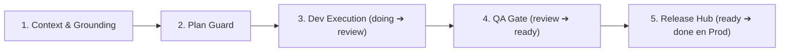

# Agentic Team Playbook: Metodología y Guardrails de Ingeniería para Equipos con IA

> **Framework de trabajo colaborativo entre desarrolladores humanos y agentes de inteligencia artificial (Antigravity, Cursor, Claude Code, GitHub Copilot) implementado nativamente en gripm (anteriormente DevBoard).**

---

## 1. Fundamentos y Filosofía

El desarrollo de software con agentes de IA no puede operar como un chat informal o un generador de código descontrolado (*"vibe coding"*). Sin estructuras de contención y disciplina operativa, los proyectos sufren de:
* **Deriva de alcance (Scope Creep):** Agentes reescribiendo módulos enteros sin solicitud previa.
* **Alucinaciones silenciosas:** Suposiciones sobre arquitecturas inexistentes, APIs obsoletas o dependencias ausentes.
* **Desfase de backlog:** Código que avanza a espaldas de la documentación y la planificación del equipo.
* **Deuda técnica y bugs de UX recurrentes:** Código parche sobre parche con saltos de scroll, touch targets diminutos o regresiones visuales.

El **Agentic Team Playbook** establece un contrato de ingeniería explícito que convierte a los agentes de IA en un equipo disciplinado, transparente, seguro y de alta velocidad.

---

## 2. 🧠 Arquitectura Bajo el Capó: Por qué los Agentes son Skills Modulares (No Enjambres de Demonios)

Un malentendido común en el desarrollo con IA es creer que un "equipo multi-agente" requiere ejecutar 5 o 6 procesos LLM en segundo plano enviándose mensajes en un chat sin fin (estilo CrewAI o AutoGen). En ingeniería de software real, los enjambres autónomos no coordinados fallan por tres razones críticas:
1. **Colisiones de estado y Git:** Procesos concurrentes tocando el mismo código generan condiciones de carrera, sobrescrituras silenciosas y conflictos destructivos de merge.
2. **Explosión descontrolada de tokens y latencia:** La charla inter-agente infla exponencialmente la ventana de contexto y multiplica los costos de API sin entregar código verificable.
3. **Alucinaciones en cascada:** Cuando un agente asume un tipo o API obsoleto, los siguientes lo toman por válido y construyen tests sobre premisas falsas.

### El Patrón Canónico: *Role-Swapping* vía *Progressive Disclosure*
El **Agentic Team Playbook** reemplaza los enjambres caóticos por una arquitectura determinista: **Un único Host Agent con Skills Modulares cargadas bajo demanda**.

```
                   ┌──────────────────────────────────────────────┐
                   │           HOST AGENT (Modelo Activo)         │
                   │    (Antigravity / Cursor / Claude Code)      │
                   └──────────────────────┬───────────────────────┘
                                          │
                  Adopta "sombreros" operacionales según la fase
                                          │
            ┌─────────────────────────────┼─────────────────────────────┐
            ▼                             ▼                             ▼
   [ principal-engineer ]       [ rigorous-qa-auditor ]      [ worldclass-designer ]
   • TypeScript estricto (0 any)• Pirámide de verificación   • Ergonomía táctil ≥44px
   • Renders 60 FPS en Kanban   • tsc + tests headless       • Sistema semántico tokens
   • Sincronización Markdown/MCP• Cero commits no solicitados• Micro-animaciones
```

* **El Host Agent:** Tu asistente de desarrollo (en Antigravity, Cursor o Claude Code) opera como el único motor de ejecución sobre el árbol de trabajo.
* **Skills como Sombreros Contextuales:** Cada rol en `.agents/skills/` es un manual de ingeniería de alta densidad que se inyecta progresivamente. Al pasar de `doing` a `review`, el agente adopta los estándares de `rigorous-qa-auditor`.
* **Hilo Único Atómico para Código:** Toda la lógica de dominio, parsers y modificaciones de Git se ejecutan en un solo hilo secuencial para garantizar determinismo y evitar condiciones de carrera.
* **Subagentes Efímeros Solo para Operaciones Sin Estado:** Los subagentes paralelos reales se reservan exclusivamente para tareas satélite que no alteran el código (ej: validaciones visuales con `browser_subagent` o benchmarking web).

### ⚖️ Matriz Comparativa: Enjambres vs. Agentic Team Playbook

| Dimensión | Enjambres Autónomos (Swarms) | Agentic Team Playbook (Skills + Role-Swapping) |
| :--- | :--- | :--- |
| **Motor de Ejecución** | Múltiples bots en background no coordinados | 1 Host Agent con sombreros especializados secuenciales |
| **Economía de Tokens** | 🔴 Despilfarro en charla inter-agente | 🟢 Inyección quirúrgica bajo demanda (*progressive disclosure*) |
| **Integridad de Git** | 🔴 Alto riesgo de colisiones y race conditions | 🟢 Modificaciones atómicas, deterministas y secuenciales |
| **Control de Calidad** | "Un LLM evaluando a otro LLM" (alucinatorio) | **Pirámide de Verificación Mecánica** (`tsc`, tests, linters) |
| **Gobernanza Humana** | 🔴 Pérdida de control / "Caja negra" | 🟢 Soberanía del PO (cero commits ni releases sin orden explícita) |

---

## 3. 🚦 Matriz de Decisión Dinámica (Autonomía y Velocidad Operativa)

Para erradicar la ineficiencia y evitar sobrecarga burocrática en tareas menores, el sistema clasifica automáticamente el requerimiento en uno de los siguientes **3 modos operativos**:

| Modo Operativo | Disparadores Típicos | Roles Involucrados | Flujo / Sobrecarga |
| :--- | :--- | :--- | :--- |
| **Modo 1: Foco Quirúrgico** *(Fast-Track)* | Bugfix puntual, corrección de tipado (`tsc`), micro-ajuste de CSS/copy, fix de scroll puntual, warnings de linter. | **Principal Engineer** (control directo y exclusivo). | **Cero burocracia documental.** Cambio atómico en código + validación (`npm run build`). |
| **Modo 2: Dúo Táctico** *(Diseño + Código)* | Rediseño de componentes visuales (`ItemModal`, `FilterBar`, `ItemCard`), micro-interacciones, ergonomía táctil, layout responsive. | **Product Designer** + **Principal Engineer** (+ QA check). | **Ligero.** Especificación directa en plan de chat o en la tarea asociada en `backlog/tasks/`. |
| **Modo 3: Backlog Flow Completo** | Feature nueva de envergadura, personalización de columnas Kanban, motor de sincronización Markdown/JSON, servidor MCP. | Loop completo: **Market Researcher** -> **Product Designer** -> **Principal Engineer** -> **QA Sentinel**. | **Formal.** Tarea en `backlog/tasks/` con criterios de aceptación detallados, plan técnico previo y verificación en navegador. |

---

## 4. 🛠️ Matriz de Roles y Skills Especializadas

Los roles del equipo están respaldados por skills operativas integradas en [`.agents/skills/`](.agents/skills/):

| Rol | Agente / Humano | Skill Vinculada | Responsabilidades Principales |
| :--- | :--- | :--- | :--- |
| **Product Owner & Scrum/Delivery Lead** | 👤 Desarrollador Humano | — | Define prioridades de negocio, amplía alcance de sprint ante entregas tempranas, arma paquetes de release por valor entregado, valida planes técnicos y autoriza commits y despliegues a prod. |
| **Architect & Principal Engineer** | 🤖 Agente de IA | [`principal-engineer`](.agents/skills/principal-engineer/SKILL.md) | TypeScript estricto (cero `any`), optimización a 60 FPS en Kanban, sincronización atómica con Markdown/JSON y estabilidad del MCP. Ejecuta en `doing` y entrega en `review`. |
| **World-Class Product Designer** | 🤖 Agente de IA | [`worldclass-product-designer`](.agents/skills/worldclass-product-designer/SKILL.md) | Estética estilo Linear/Notion, tokens semánticos refinados, micro-animaciones `active:scale-[0.98]` y ergonomía para power users. |
| **QA Sentinel & UX Auditor** | 🤖 / ⚙️ Hook Automatizado | [`rigorous-qa-auditor`](.agents/skills/rigorous-qa-auditor/SKILL.md)<br>[`code-level-ux-auditor`](.agents/skills/code-level-ux-auditor/SKILL.md) | Guardián pre-entrega: audita items en `review`, ejecuta pirámide de verificación y formaliza la entrega de desarrollo pasando el ítem a `ready`. |
| **Market & Agile Researcher** | 🤖 Agente de IA | [`market-researcher`](.agents/skills/market-researcher/SKILL.md) | Benchmarking acelerado contra referentes líderes (Linear, Jira, GitHub Projects, Height, Notion) para resolver UX sin intuición vacía. |
| **List & Views Architect** | 🤖 Agente de IA | [`list-views-filters`](.agents/skills/list-views-filters/SKILL.md) | Arquitectura de barras de filtrado unificadas (`FilterBar`), popovers con contadores, reseteo rápido y estados vacíos diferenciados. |

---

## 5. 🤖 Autonomía de Subagentes y Pirámide de Verificación

> **Regla de Oro:** *"Foco absoluto en la lógica central y parsers de datos; manos paralelas en la exploración y verificación visual."*

### 🟢 Cuándo SÍ sumar manos (Subagentes / Tareas Paralelas):
1. **Auditoría Visual de Navegación (`browser_subagent`):**
   - Reservado **exclusivamente** para layouts visuales de CSS no deducibles estáticamente, problemas de renderizado visual o pedido explícito del usuario.
2. **Benchmarking Exploratorio (Market Researcher):**
   - Investigar patrones en apps referentes o consultar documentación mientras se diseña la arquitectura.
3. **Auditorías de Código Estáticas:**
   - Ejecutar en paralelo suites como `npm run audit:ux` para detectar touch targets deficientes o falta de `min-w-0`.

### 🔴 Cuándo mantener FOCO ABSOLUTO (Un solo hilo atómico, sin subagentes):
1. **Parsers y Sincronización Markdown/JSON (Estándar Backlog.md):**
   - Modificaciones en `scripts/backlogMdParser.ts`, `backlog/tasks/*.md`, `backlog/releases.json` y `BACKLOG.md` requieren trazabilidad estricta para evitar condiciones de carrera o corrupción de etiquetas HTML comentadas.
2. **Servidor MCP y Binarios Autónomos (`bin/gripm-mcp.js`, `bin/gripm.js`):**
   - La API de herramientas MCP debe ser alterada por un único hilo técnico para garantizar compatibilidad hacia atrás.
3. **Estado Central y Eventos SSE:**
   - Cambios en el motor de sincronización en tiempo real y hot-reload.

---

## 6. 🔄 El Flujo Ágil de Entrega (Las 5 Fases)



### Fase 1: Context & Grounding (Anclaje de Contexto)
* Ningún agente comienza a codificar sin haber anclado su contexto en una tarea de `backlog/tasks/<ID> - <slug>.md`.
* Se leen los requerimientos (`<!-- SECTION:DESCRIPTION:BEGIN -->`) y los criterios de aceptación (`<!-- AC:BEGIN -->`).
* Si el requerimiento es nuevo, se crea la tarea primero utilizando `gripm_create_task` o en Markdown nativo.

### Fase 2: Plan Guard (Barrera de Planificación)
* Para cambios que afecten arquitectura, dependencias o múltiples componentes:
  1. El agente formula un plan paso a paso en la sección `<!-- SECTION:PLAN:BEGIN -->` de la tarea (o en `implementation_plan.md`).
  2. El Tech Lead revisa y aprueba el enfoque antes de que se modifique el código.
* **Regla de Oro:** *"Planifica antes de escribir; no corrijas en caliente lo que no entendiste al diseñar."*

### Fase 3: Dev Execution (`doing` ➔ `review`)
* La tarea pasa a `status: doing`.
* Cada criterio de aceptación completado se tilda en tiempo real (`- [x]` o `toggleAcIndex`).
* El agente no altera archivos ajenos al alcance de la tarea.
* Al concluir la implementación y pruebas locales, el desarrollador pasa la tarea a `status: review`.

### Fase 4: QA Gate (`review` ➔ `ready`) — Entrega Formal de Desarrollo
* El rol de QA audita la tarea bajo la **Pirámide de Verificación (Cero Desperdicio de Tokens)**:
  1. ✅ `npx tsc --noEmit` — 0 errores de tipado TypeScript estricto.
  2. ✅ `npm test` — Pruebas de parser e integración headless (~300ms, código 0).
  3. ✅ `npm run backlog:check` — Coherencia de tareas, versiones y releases (código 0).
  4. ✅ `npm run build` — Bundle Vite y binarios standalone en `bin/`.
* **Anti-Browser-Subagent Ineficiente:** Prohibido invocar `browser_subagent` para verificar lógica, estado, contratos de API o persistencia que se auditan en milisegundos de forma headless. Se reserva únicamente para validaciones visuales de CSS o pedido explícito del usuario.
* Si supera los gates, QA pasa la tarea a `status: ready`.
* **`ready` es la entrega formal de desarrollo**: el ítem queda inmediatamente disponible para ser empaquetado e implementado.

### Fase 5: Release Management & Implementación en Prod (`ready` ➔ `done`)
* **Armado de Paquetes por Valor:** Release Management (PO + Scrum/Delivery Lead) agrupa cualquier ítem en `ready` (sea del sprint actual o histórico) según el valor a entregar.
* **Desacople Sprint vs. Release:** Sprints y releases no tienen vinculación 1:1. Un release se compone exclusivamente por el valor entregado agrupando ítems disponibles en `ready`, con o sin sprint activo.
* **Implementación en Producción (`done`):** Al comitear y pushear la versión liberada a producción (main cloud), los ítems empaquetados pasan a `status: done`.
* **Invariante Fundamental:** **No puede haber un ítem en producción que no esté en `done`**.
* El archivo Markdown de la tarea se incluye en el mismo commit de Git que el código fuente.

---

## 7. ⏱️ Ciclo de Vida de Sprints y Soberanía del PO

1. **Timebox Fijo:** En primera opción, el sprint finaliza cuando vence su plazo programado (duración fija), independientemente del progreso alcanzado. Lo no completado se re-planifica al siguiente sprint o vuelve al backlog.
2. **Productividad Continua:** Si los ítems se entregan antes del vencimiento del timebox, el PO amplía el alcance incorporando nuevos ítems refinados del backlog para no pausar la productividad. Raramente un sprint concluye de forma anticipada.
3. **Prohibido el Cierre o Retro por Deducción:** El agente **NUNCA** cierra un sprint ni ejecuta una retrospectiva por iniciativa propia. Ambas acciones se ejecutan **única y exclusivamente ante orden textual y explícita del PO** (ej: *"cerremos el sprint"*, *"hacé la retro del sprint"*).
4. **Salidas Obligatorias de la Retro:** Actualizar gotchas en `AGENTS.md`, actualizar skills relevantes y crear tareas en el backlog para mejoras identificadas.

---

## 8. 🛡️ Guardrails de Contención Estricta

1. **Código sin Tarea no Existe:**
   Cualquier commit sin una tarea asociada en `backlog/tasks/` se considera deuda técnica o código no verificado.
2. **Prohibición Estricta de Git sin Autorización Expresa:**
   El agente NUNCA ejecuta `git commit` ni `git push` por deducción propia. Resolver un bug, tildar ACs o compilar NO autoriza a comitear. El commit se ejecuta única y exclusivamente ante orden textual explícita del usuario.
3. **Invariante de Producción:**
   Ningún ítem puede considerarse o marcarse en `done` si no está efectivamente implementado y liberado en producción.
4. **Prohibición de Destrucción Histórica:**
   Las tareas en `done` jamás se borran del disco; son el registro de auditoría de por qué el código es como es. Si una tarea se cancela, pasa a `dismissed` y se mueve a `backlog/archive/`.
5. **Dogfooding Continuo:**
   gripm se desarrolla utilizando gripm. Todo agente trabajando en este repositorio debe utilizar las herramientas MCP (`gripm_*`) y respetar el estándar **Backlog.md**.

---

## 9. 🧠 Protocolo de Aprendizaje Continuo (Memoria Viva)

Al resolver cualquier incidencia o refactorizar:
1. Si se descubre un nuevo anti-patrón de interfaz o colisión de scroll, se añade como heurística en [`.agents/skills/code-level-ux-auditor/SKILL.md`](.agents/skills/code-level-ux-auditor/SKILL.md) y en [`scripts/audit-ux-code.cjs`](../scripts/audit-ux-code.cjs).
2. Si un patrón arquitectónico resulta superior, se documenta en la skill respectiva.
3. **Ningún error de tipado o UX se corrige dos veces a ciegas: se convierte en una regla permanente del proyecto.**

---

## 10. 🌐 Distribución y Sincronización Universal: Separación de Capas

Para que el framework sea consumible y actualizable en **cualquier proyecto** (sea React, Python, Go, Rust o Swift) sin riesgo de sobreescritura accidental, la arquitectura se divide en dos capas desacopladas:

```
📦 Tu Repositorio
├── 🟢 Capa Framework (Actualizable con un comando)
│   ├── .agents/skills/*           # Heurísticas de QA, UX, Arquitectura y Producto
│   ├── .agents/TEAM_PLAYBOOK.md   # Modos, subagentes y pirámide de verificación
│   └── scripts/audit-ux-code.cjs  # Escáner estático de anti-patrones móviles/UX
│
└── 🔒 Capa de Negocio / Proyecto (Preservada al 100%, nunca se sobreescribe)
    ├── AGENTS.md                  # Stack particular, modelos de datos, reglas de negocio
    └── backlog/                   # Tareas, sprints y releases propios
```

### Comando Universal de Sincronización
Para traer la última versión canónica del Playbook desde [upstream](https://github.com/pablojavierrodriguez/agentic-team-playbook) a este repositorio o a cualquier otro proyecto:

```bash
# Dentro de gripm:
npm run playbook:sync

# En cualquier otro repositorio (Node, Python, Go, etc.):
npx @gripm/board playbook sync
```

El script actualiza las skills y heurísticas en `.agents/skills/`, preservando sagradamente tu `AGENTS.md` y tus datos locales.
